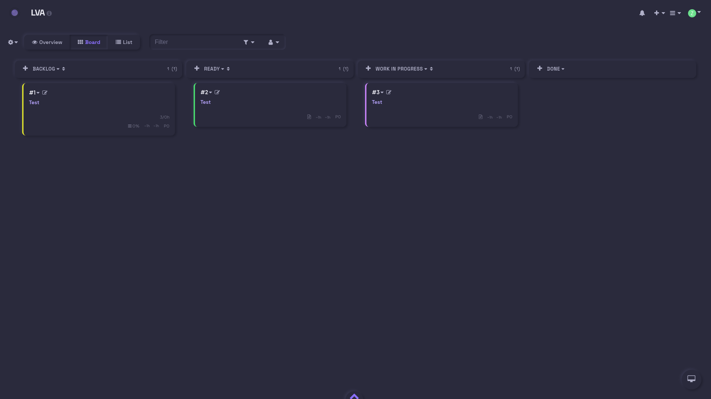
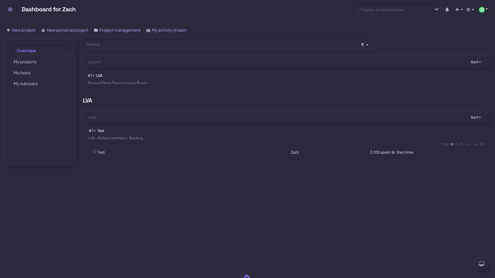
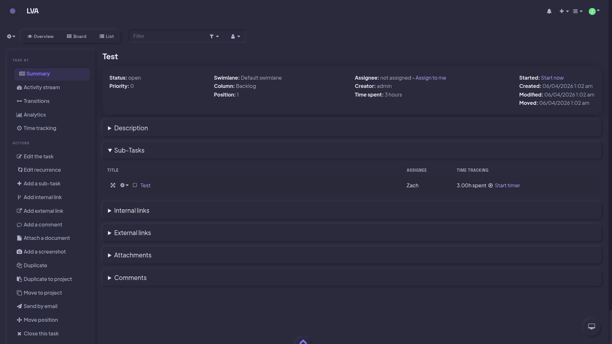
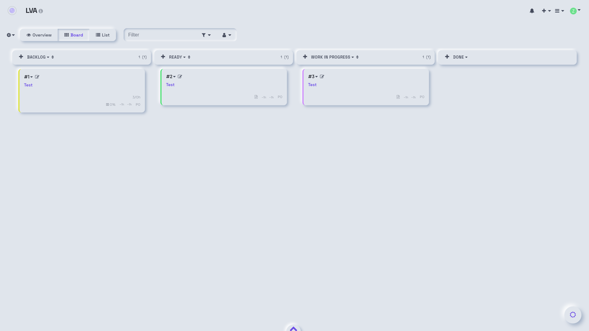
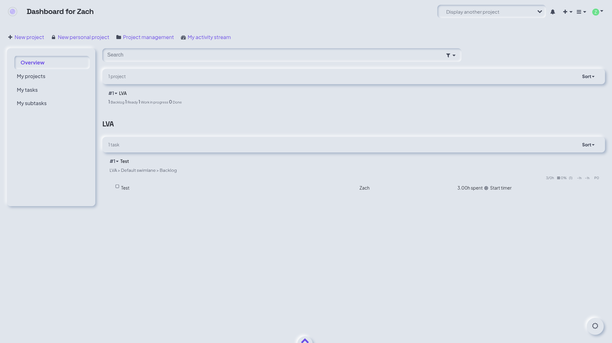
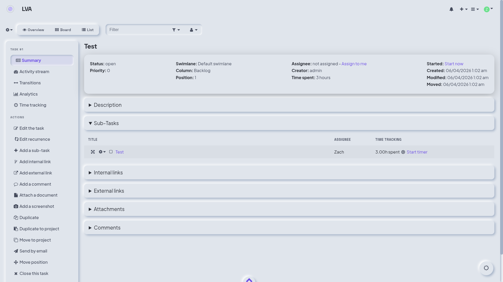

# Neumorphism

A clean, modern neumorphic theme for [Kanboard](https://kanboard.org/) with dark, light, and system modes.

> **Branch note:** This is the `neumorphism` branch. For the cyberpunk theme, switch to `master`.

## Screenshots

### Dark Mode




### Light Mode




## Features

- **True neumorphic design** — Same-surface extrusion via shadow pairs. Elements raise from or press into a single unified surface.
- **Three theme modes** — System (follows OS preference), Light, and Dark. Click the toggle in the bottom-right corner to cycle. Persists via cookie.
- **Space Grotesk + Plus Jakarta Sans** — Distinctive geometric display font for headings and buttons, warm humanist sans for body text, Iosevka monospace for code.
- **GSAP animations** — Smooth entrance animations for cards, columns, nav items, modals, and dropdowns with count-up stat numbers.
- **Syntax highlighting** — 151+ languages via Prism.js with soft, readable colors tuned to both modes.
- **Customizer plugin support** — Compatible with the [Customizer](https://github.com/creecros/Customizer) plugin.
- **Accessible** — Readable text contrast in both dark and light modes.

## Requirements

- Kanboard >= v1.0.48

## Installation

1. Install from the Kanboard plugin manager, **or**
2. Download the zip and extract to `plugins/Cyberpunk`, **or**
3. Clone the neumorphism branch:
   ```
   cd /path/to/kanboard/plugins
   git clone -b neumorphism https://github.com/RAOEUS/cyberpunk-kanboard.git Cyberpunk
   ```

> The folder **must** be named `Cyberpunk` (case-sensitive) — Kanboard loads plugins by folder name.

## Configuration

On first run, the plugin copies a config file to `data/files/Cyberpunk/config.php`. Edit that file to customize settings.

### Custom Logo

```php
$themeCyberpunkConfig['logo'] = 'plugins/Cyberpunk/Assets/images/your-logo.svg';
```

### Theme Mode

Click the toggle button in the bottom-right corner to cycle between:
- **System** (desktop icon) — follows your OS dark/light preference
- **Light** (sun icon) — forces light mode
- **Dark** (moon icon) — forces dark mode

Your preference is saved in a cookie and persists across sessions.

## Syntax Highlighting

Use fenced code blocks with a language identifier:

~~~
```php
class BaseClass {
    function __construct() {
        print "In BaseClass constructor\n";
    }
}
```
~~~

151 languages supported via Prism.js.

## License

MIT
