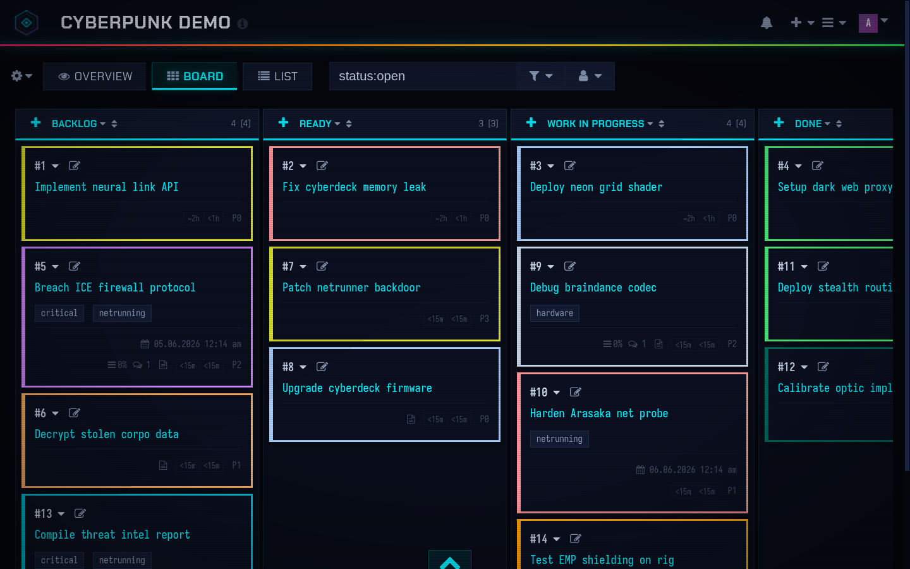
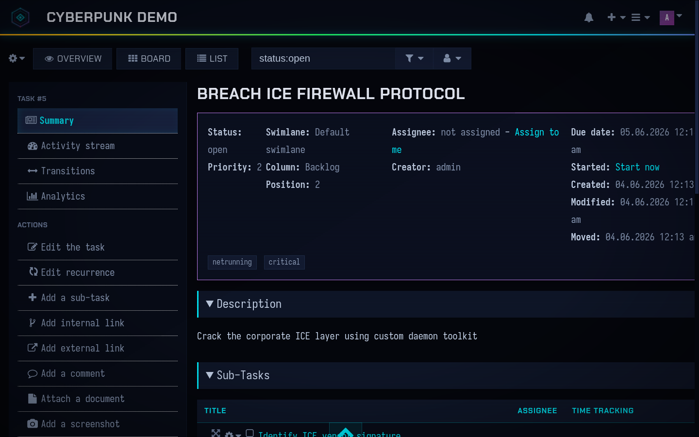
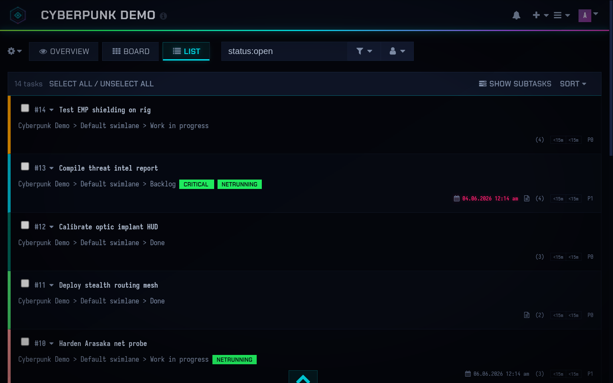
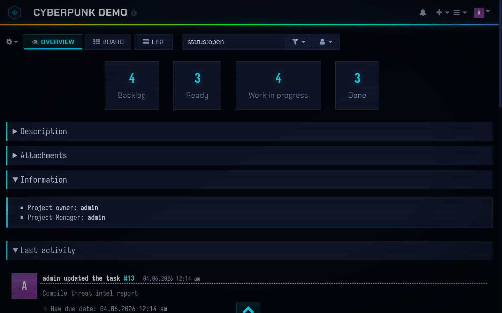
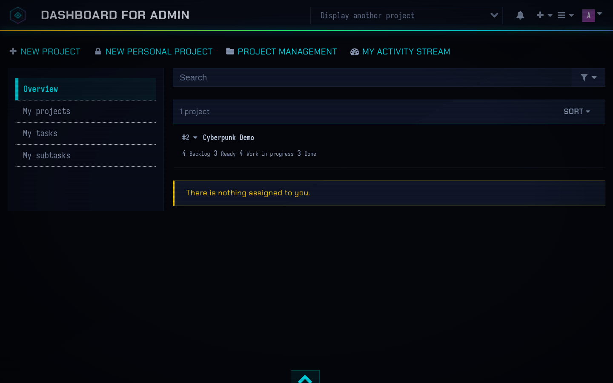
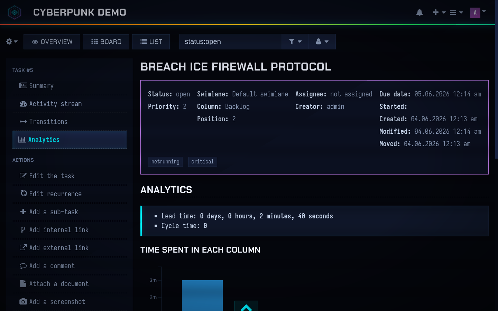

# Cyberpunk

A Cyberpunk 2077-inspired theme for [Kanboard](https://kanboard.org/). 

## Screenshots

### Board View


### Task Detail


### Task List


### Project Overview


### Dashboard


### Analytics


## Features

- **CP2077 aesthetic** - Angular Chakra Petch display font, Iosevka monospace body, sharp zero-radius edges, neon cyan/magenta/purple accents
- **Animated header** - Rainbow neon gradient line with smooth looping animation
- **Scanlines + CRT vignette** - Subtle overlay for that authentic retro-future feel
- **Digital glitch on hover** - Randomized clip-path tears, opacity flashes, hue corruption, RGB channel split shadows on every interactive element
- **Periodic title glitch** - Header title glitches randomly, faster when hovered
- **GSAP animations** - Staggered entrance animations for cards, columns, nav items, modals, dropdowns, overview stats (with count-up)
- **Drag-and-drop fix** - Clean card dragging with no lag or position offset
- **Custom SVG logo** - Hexagonal cyber-eye emblem, links to dashboard
- **Full C3 chart theming** - Dark tooltips, themed axes and grid lines
- **WCAG AA contrast** - All text passes 4.5:1 minimum contrast ratio
- **Syntax highlighting** - 151+ languages via Prism.js, tuned to the neon palette
- **Customizer plugin support** - Compatible with the [Customizer](https://github.com/creecros/Customizer) plugin
- **Bundled fonts** - Chakra Petch (display) + Iosevka Term Nerd Font (mono), no external CDN dependencies

## Requirements

- Kanboard >= v1.0.48

## Installation

1. Install from the Kanboard plugin manager, **or**
2. Download the zip and extract to `plugins/Cyberpunk`, **or**
3. Clone this repository:
   ```
   git clone https://github.com/RAOEUS/Cyberpunk.git plugins/Cyberpunk
   ```

> Plugin folder is case-sensitive. Remove all unused themes.

## Configuration

### Custom Logo

Replace the default logo by editing `data/files/Cyberpunk/config.php`:

```php
$themeCyberpunkConfig['logo'] = 'plugins/Cyberpunk/Assets/images/your-logo.svg';
```

### Disable Glitch Effects

The hover glitch effects (clip-path tears, RGB split, opacity flashes, hue corruption) can be turned off site-wide by adding this to Kanboard's **Settings > Custom Stylesheet**:

```css
:root {
    --glitch-enabled: 0;
}
```

Set back to `1` (or remove the override) to re-enable.

## Syntax Highlighting

Use fenced code blocks with a language identifier:

~~~
```php
class BaseClass {
    function __construct() {
        print "In BaseClass constructor\n";
    }
}
```
~~~

151 languages supported via Prism.js.

## License

MIT

## Credits

Originally based on [Nebula](https://github.com/kenlog/nebula) by Valentino Pesce.
